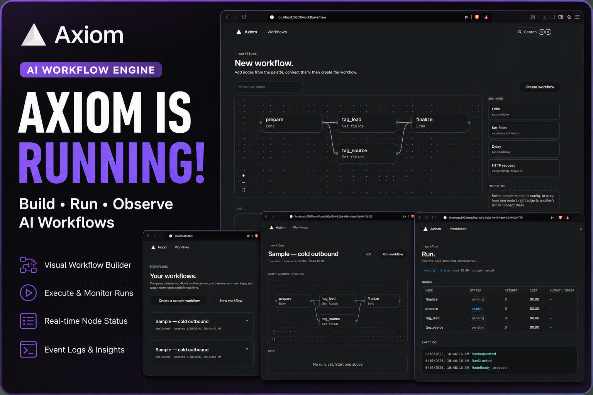

<p align="center">
  
</p>
<div align="center">
<br/>

<h1>AXIOM</h1>
<h3>Open-Source GTM Workflow Orchestration Engine</h3>

<p>Self-hosted. Composable. Built for operators who automate enrichment, scraping, outreach, and data pipelines — not just trigger isolated tasks.</p>

<br/>

[](https://python.org)
[](https://fastapi.tiangolo.com/)
[](https://react.dev/)
[](https://www.postgresql.org/)
[](https://langchain-ai.github.io/langgraph/)
[](https://www.docker.com/)

[](LICENSE)
[]()
[]()

</div>

---

## The Problem

Modern GTM stacks are fragmented. Enrichment runs in one tool. Scraping in another. Outreach in a third. Data processing somewhere else entirely.

Every automation is a one-off script, a brittle Zapier chain, or an expensive SaaS black box.

**Axiom replaces all of it** — with a self-hosted, Postgres-backed DAG execution engine where you define, version, and run end-to-end workflows as composable pipelines.

---

## What Axiom Does

```
Input Source → Enrichment Steps → Filter / Transform → Outreach → Output / Sink
     ↓               ↓                    ↓               ↓            ↓
  CSV / API     Clay · Apollo      Conditional Logic    Email/LinkedIn   CRM / DB
  Webhook       LinkedIn          Deduplication          Sequence        Webhook
  Database      Web Scraper       Scoring / Ranking      Notification    Export
```

Each step in a workflow is a **node** — a typed, versioned unit with defined inputs, outputs, retry logic, and error handling. Nodes connect into **DAGs**. DAGs are what you run.

---

## Architecture

### Core Engine

```
┌─────────────────────────────────────────────────────────┐
│                     Axiom Engine                        │
│                                                         │
│  ┌─────────────┐    ┌──────────────┐    ┌───────────┐  │
│  │  DAG Parser  │───▶│  Scheduler   │───▶│  Executor │  │
│  │  (Pydantic)  │    │  (Topological│    │  (Async)  │  │
│  └─────────────┘    │   Sort)      │    └───────────┘  │
│                     └──────────────┘          │         │
│                                               ▼         │
│  ┌─────────────┐    ┌──────────────┐    ┌───────────┐  │
│  │  Node SDK    │    │  State Store │◀───│  Workers  │  │
│  │  (Python)    │    │  (Postgres)  │    │  (Celery) │  │
│  └─────────────┘    └──────────────┘    └───────────┘  │
└─────────────────────────────────────────────────────────┘
```

### Repository Structure

```
axiom/
├── engine/           — DAG execution runtime (core)
│   ├── parser.py     — Workflow YAML/JSON → validated DAG
│   ├── scheduler.py  — Topological sort + dependency resolution
│   ├── executor.py   — Async node execution with retry/backoff
│   └── state.py      — Execution state machine (PENDING → RUNNING → DONE)
│
├── nodes/            — Built-in node library
│   ├── enrichment/   — Apollo, Clay, LinkedIn, Clearbit
│   ├── scraping/     — Playwright, HTTP, RSS
│   ├── transform/    — Filter, Deduplicate, Score, Map
│   ├── outreach/     — Email sequence, LinkedIn DM, Webhook
│   └── output/       — Postgres, CSV, CRM sinks
│
├── api/              — FastAPI REST + WebSocket
│   ├── workflows/    — CRUD, trigger, schedule
│   ├── runs/         — Execution history, logs, replay
│   └── nodes/        — Node registry and schemas
│
├── worker/           — Celery task queue
├── web/              — React 19 dashboard
└── sdk/              — Python SDK for custom nodes
```

---

## Why Axiom Over Alternatives?

| | Axiom | n8n | Zapier | Clay |
|---|---|---|---|---|
| Self-hosted | ✅ | ✅ | ❌ | ❌ |
| Custom nodes (Python SDK) | ✅ | ❌ | ❌ | ❌ |
| DAG with branching + joins | ✅ | Partial | ❌ | ❌ |
| Version-controlled workflows | ✅ | ❌ | ❌ | ❌ |
| AI-native node types | ✅ | ❌ | ❌ | Partial |
| No per-task pricing | ✅ | ✅ | ❌ | ❌ |
| Postgres-backed state | ✅ | ❌ | ❌ | ❌ |

---

## Node SDK

Define custom nodes in Python. Axiom handles scheduling, retries, logging, and UI registration automatically.

```python
from axiom.sdk import Node, NodeInput, NodeOutput

class EnrichContactNode(Node):
    name = "enrich_contact"
    description = "Enriches a contact record via Apollo and LinkedIn"

    class Input(NodeInput):
        email: str
        company: str | None = None

    class Output(NodeOutput):
        full_name: str
        title: str
        linkedin_url: str
        company_size: int
        enrichment_confidence: float

    async def execute(self, input: Input) -> Output:
        apollo_data = await self.integrations.apollo.enrich(input.email)
        linkedin_data = await self.integrations.linkedin.lookup(input.email)

        return self.Output(
            full_name=apollo_data.name,
            title=apollo_data.title,
            linkedin_url=linkedin_data.profile_url,
            company_size=apollo_data.company.headcount,
            enrichment_confidence=self._score_confidence(apollo_data, linkedin_data)
        )
```

Register once in `axiom.config.py` — the node appears in the workflow builder UI automatically.

---

## Workflow Definition

Workflows are YAML — version-controlled, diffable, and portable:

```yaml
name: inbound-icp-enrichment
version: 2
trigger:
  type: webhook
  path: /hooks/new-signup

steps:
  - id: enrich
    node: enrich_contact
    input:
      email: "{{ trigger.email }}"
      company: "{{ trigger.company }}"

  - id: score
    node: icp_scoring
    depends_on: [enrich]
    input:
      contact: "{{ enrich.output }}"
      icp_profile: "saas-smb-v3"

  - id: route
    node: conditional_branch
    depends_on: [score]
    branches:
      - condition: "{{ score.output.fit_score >= 0.8 }}"
        next: high_intent_sequence
      - condition: "{{ score.output.fit_score >= 0.5 }}"
        next: nurture_sequence
      - default: true
        next: archive

  - id: high_intent_sequence
    node: email_sequence
    depends_on: [route]
    input:
      contact: "{{ enrich.output }}"
      sequence_id: "hs-demo-request"
```

---

## Tech Stack

| Layer | Technology | Why |
|---|---|---|
| **Runtime** | Python 3.12, asyncio | Native async for high-throughput node execution |
| **API** | FastAPI | Auto-generated OpenAPI, async request handling |
| **Execution** | Celery + Redis | Distributed workers, priority queues |
| **State** | PostgreSQL + SQLAlchemy | Full queryability, point-in-time replay |
| **Migrations** | Alembic | Version-controlled schema changes |
| **AI Nodes** | LangGraph + Groq | Agentic reasoning within DAG execution |
| **Frontend** | React 19, TypeScript | Workflow builder, run monitoring, node registry |
| **UI** | Tailwind CSS, shadcn/ui | Consistent component system |
| **Auth** | JWT + RBAC | Multi-user workspace support |
| **Infra** | Docker, Docker Compose | Single-command self-hosted deployment |
| **Testing** | Pytest, Playwright | Unit + integration + E2E |

---

## Getting Started

### Prerequisites

- Docker and Docker Compose
- Python 3.12+ (for SDK development)

### 1. Clone and Configure

```bash
git clone https://github.com/vidorc/Axiom.git
cd Axiom
cp .env.example .env
```

Edit `.env`:

```env
DATABASE_URL=postgresql://axiom:axiom@db:5432/axiom
REDIS_URL=redis://redis:6379/0
SECRET_KEY=your-secret-key-here
GROQ_API_KEY=gsk_your_groq_api_key
APOLLO_API_KEY=your_apollo_key
```

### 2. Start Everything

```bash
make up
```

| Service | URL |
|---|---|
| Dashboard | http://localhost:3000 |
| API | http://localhost:8000 |
| Swagger Docs | http://localhost:8000/docs |
| Worker Monitor | http://localhost:5555 |

### 3. Migrate and Seed

```bash
make migrate
```

### 4. Trigger a Workflow

```bash
curl -X POST http://localhost:8000/api/workflows/trigger \
  -H "Content-Type: application/json" \
  -d '{"workflow": "example-enrichment", "input": {"email": "test@example.com"}}'
```

---

## Development

```bash
make setup       # Install dev dependencies
make dev-api     # FastAPI with hot reload
make dev-web     # React dev server
make test        # Full test suite
make lint        # Ruff + mypy + ESLint
make migrate     # Run Alembic migrations
make clean       # Remove containers and volumes
```

---

## Use Cases

**Lead Enrichment Pipeline** — Inbound signup hits webhook → enrich via Apollo → score ICP fit → route to email sequence or archive → update CRM

**Prospect Research** — Upload CSV of target accounts → scrape company websites → enrich contacts → generate personalized outreach angles → export to Outreach

**Data Processing** — Pull from multiple API sources → deduplicate → normalize → transform → load into database or BI tool

**Competitive Intelligence** — Monitor competitor job postings, pricing pages, and product releases → filter by relevance → summarize via LLM → push to Slack

---

## Roadmap

### ✅ Phase 0 — Architecture (Complete)
- [x] Domain model and ADR documentation
- [x] DAG execution engine design
- [x] Node SDK specification
- [x] Database schema and migration framework
- [x] API surface design
- [x] Frontend design system
- [x] Docker development environment
- [x] Security model (JWT + RBAC)

### 🚧 Phase 1 — Core Engine (Active)
- [ ] DAG parser and validator
- [ ] Topological scheduler
- [ ] Async executor with retry/backoff
- [ ] Postgres state store
- [ ] REST API (CRUD + trigger)
- [ ] React dashboard MVP
- [ ] Built-in node library

### 🔮 Phase 2 — Workflow Intelligence
- [ ] LangGraph AI node types
- [ ] Visual drag-and-drop workflow builder
- [ ] Workflow versioning and diff view
- [ ] Execution replay and step-level debugging
- [ ] Webhook and cron trigger system

### 🔮 Phase 3 — Production Hardening
- [ ] Multi-workspace support
- [ ] Secrets management vault
- [ ] Rate limiting per integration
- [ ] Workflow marketplace (community templates)
- [ ] One-click Railway / Render deployment

---

## Self-Hosting

Axiom runs entirely on your infrastructure. No usage-based pricing. No vendor lock-in. No data leaving your environment.

**Minimum requirements:** 2 vCPU · 4GB RAM (dev) · 4 vCPU · 8GB RAM (production)

Runs on: any VPS, Railway, Render, Fly.io, AWS EC2, GCP, or bare metal.

---

## Contributing

Axiom is early-stage and actively developed. Contributions are welcome.

```bash
git clone https://github.com/YOUR_USERNAME/Axiom.git
git checkout -b feat/your-feature-name
make test && make lint
# then open a pull request
```

---

## 👨‍💻 Author

**Mayank Sharma** — Autonomous AI Systems Engineer

Building production-grade AI systems that replace manual workflows end-to-end.

[](https://github.com/vidorc)
[](https://linkedin.com/in/mayank-sharma)

---

## 📄 License

MIT — see [LICENSE](LICENSE) for details.

---

<div align="center">
<sub>Built with intentional architecture. Designed to replace, not augment.</sub>
</div>
